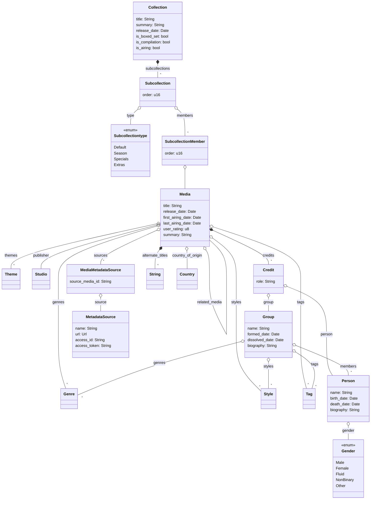

# Design

```mermaid
classDiagram
	class Collection {
		title: String
		summary: String
		release_date: Date
		is_boxed_set: bool
		is_compilation: bool
		is_airing: bool
	}
	Collection *--"*" Subcollection: subcollections

	class Subcollection {
		order: u16
	}
	Subcollection o-- Subcollectiontype: type
	Subcollection o--"*" SubcollectionMember: members

	class SubcollectionMember {
		order: u16
	}
	SubcollectionMember o-- Media

	class Subcollectiontype {
		<<enum>>
		Default
		Season
		Specials
		Extras
	}

	class Media {
		title: String
		release_date: Date
		first_airing_date: Date
		last_airing_date: Date
		user_rating: u8
		summary: String
	}
	Media o--"*" Genre: genres
	Media o--"*" Style: styles
	Media o--"*" Tag: tags
	Media o--"*" Theme: themes
	Media o-- Studio: publisher
	Media *--"*" Credit: credits
	Media o--"*" MediaMetadataSource: sources
	Media *--"*" String: alternate_titles
	Media o-- Country: country_of_origin
	Media o-- Media: related_media

	class Credit {
		role: String
	}
	Credit o-- Group: group
	Credit o-- Person: person

	class Group {
		name: String
		formed_date: Date
		dissolved_date: Date
		biography: String
	}
	Group o--"*" Person: members
	Group o--"*" Genre: genres
	Group o--"*" Style: styles
	Group o--"*" Tag: tags

	class Person {
		name: String
		birth_date: Date
		death_date: Date
		biography: String
	}
	Person o-- Gender: gender

	class MetadataSource {
		name: String
		url: Url
		access_id: String
		access_token: String
	}

	class MediaMetadataSource {
		source_media_id: String
	}
	MediaMetadataSource o-- MetadataSource: source

	class Gender {
		<<enum>>
		Male
		Female
		Fluid
		NonBinary
		Other
	}
```
