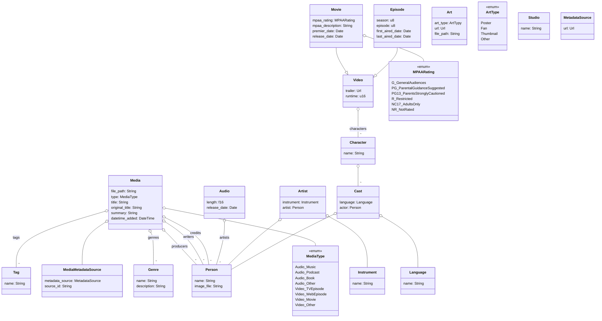

# Design

```mermaid
classDiagram
	class Media {
		file_path: String
		type: MediaType
		title: String
		original_title: String
		summary: String
		datetime_added: DateTime
	}
	Media o-- MediaType
	Media o--"*" Genre: genres
	Media o--"*" Person: producers
	Media o--"*" Person: writers
	Media o--"*" Person: credits
	Media o-- MediaMetadataSource
	Media o--"*" Tag: tags

	class MediaMetadataSource {
		metadata_source: MetadataSource
		source_id: String
	}

	class Audio {
		length: f16
		release_date: Date	
	}
	Audio o--"*" Person: artists

	class Video {
		trailer: Url
		runtime: u16
	}
	Video o--"*" Character: characters

	class Movie {
		mpaa_rating: MPAARating
		mpaa_description: String
		premier_date: Date
		release_date: Date	
	}
	Movie --|> Video
	Movie o-- MPAARating

	class Episode {
		season: u8
		episode: u8
		first_aired_date: Date
		last_aired_date: Date
	}
	Episode --|> Video

	class Art {
		art_type: ArtTypy
		url: Url
		file_path: String
	}

	class ArtType {
		<<enum>>
		Poster
		Fan
		Thumbnail
		Other
	}

	class Tag {
		name: String
	}

	class Studio {
		name: String
	}

	class MPAARating {
		<<enum>>
		G_GeneralAudiences
		PG_ParentalGuidanceSuggested
		PG13_ParentsStronglyCautioned
		R_Restricted
		NC17_AdultsOnly
		NR_NotRated
	}

	class Artist {
		instrument: Instrument
		artist: Person
	}
	Artist o-- Instrument
	Artist o-- Person

	class Instrument {
		name: String
	}

	class Character {
		name: String
	}
	Character o--"*" Cast

	class Cast {
		language: Language
		actor: Person
	}
	Cast o-- Language
	Cast o-- Person

	class Language {
		name: String
	}

	class Person {
		name: String
		image_file: String
	}

	class Genre {
		name: String
		description: String
	}

	class MediaType {
		<<enum>>
		Audio_Music
		Audio_Podcast
		Audio_Book
		Audio_Other
		Video_TVEpisode
		Video_WebEpisode
		Video_Movie
		Video_Other
	}

	class MetadataSource {
		url: Url
	}
```
